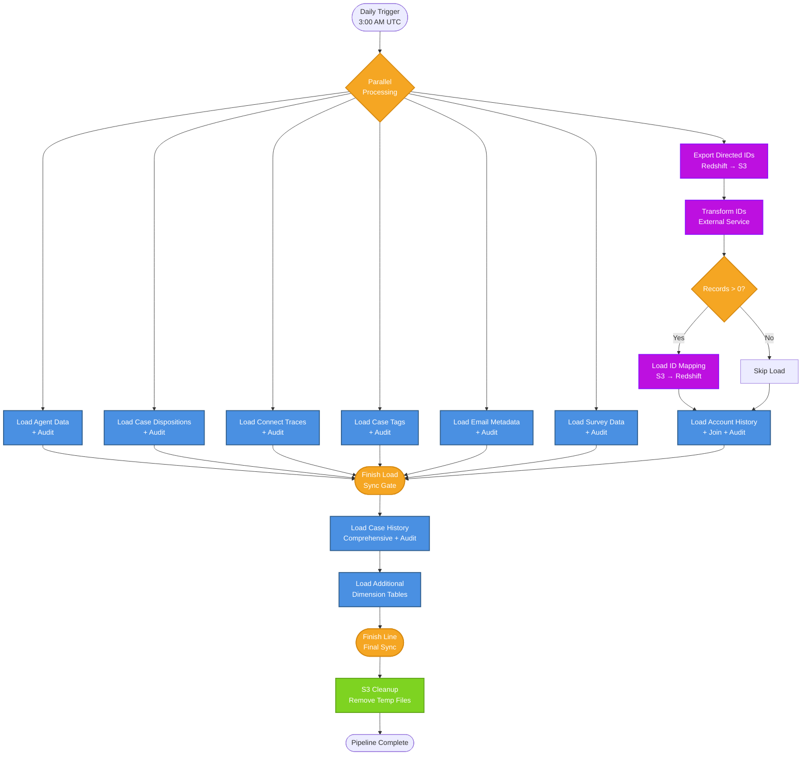
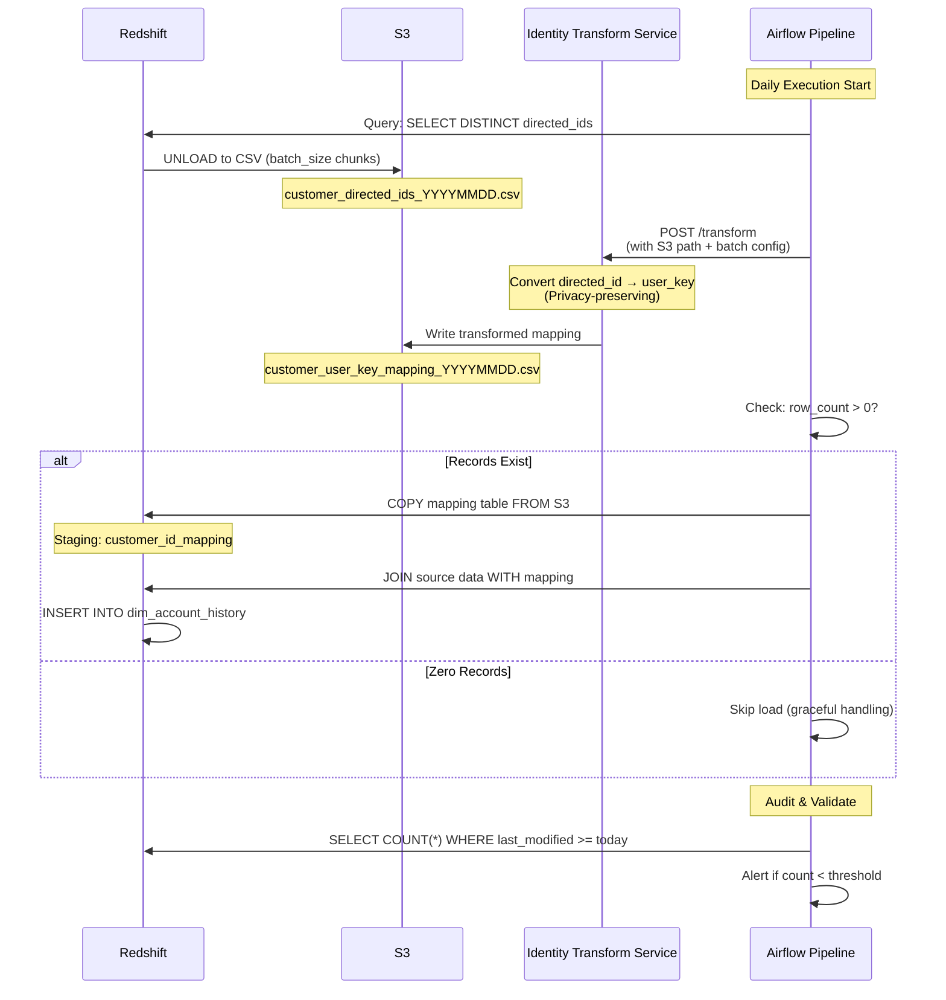

# Salesforce Customer Support Data Pipeline

## Project Overview

Built and maintained a complex batch data orchestration pipeline that processes daily customer support events from Salesforce, transforming and loading data into a dimensional data warehouse. The pipeline handles privacy-sensitive customer data with enterprise-grade security controls while maintaining 24/7 operational reliability.

**Technology Stack:** Apache Airflow, Python, AWS Redshift, AWS S3, PostgreSQL

**Role:** Senior Data Engineer  

---

## Architecture & Scale

### Data Volume
- **Daily Processing:** Processes 15+ distinct Salesforce entity types daily
- **Table Targets:** Populates dimensional tables across multiple domains (accounts, cases, agents, surveys, emails, etc.)
- **Data Sources:** Integrates event stream data from Salesforce production environments
- **Processing Window:** 3-hour SLA with daily 3:00 AM UTC execution

### Pipeline Structure
The DAG orchestrates a complex dependency graph with:
- **Parallel Processing Paths:** Multiple independent streams process different entity types simultaneously
- **Sequential Checkpoints:** Critical dependencies ensure data consistency (e.g., account data before case history)
- **Convergence Points:** Synchronization gates where parallel streams meet before final aggregation
- **Data Quality Gates:** Automated audit operators validate row counts and data freshness at each stage

### Pipeline Architecture Diagram

**Diagram Key:**
- **Blue Nodes:** Data load operations with integrated audit checks
- **Orange Nodes:** Synchronization gates and decision points
- **Purple Nodes:** Identity transformation pipeline
- **Green Nodes:** Cleanup operations

---

## Technical Challenges Solved

### 1. Privacy-Preserving Identity Resolution
**Challenge:** Customer support data contained privacy-sensitive identifiers that needed to be transformed before warehouse storage while maintaining referential integrity across multiple fact and dimension tables.

**Solution:**
- Implemented a batch transformation workflow using a dedicated identity resolution service
- Exported directed IDs from Redshift to S3 in configurable batch sizes
- Called external transformation service to convert to internal user keys
- Loaded transformed mappings back to Redshift for join operations
- Handled edge cases where no conversion was needed (0 row scenario)

**Technical Details:**

**Flow Breakdown:**
1. **Export Phase:** Redshift UNLOAD → S3 (configurable batch sizes for memory optimization)
2. **Transform Phase:** External service converts IDs (with 3-attempt retry, 5-min delay)
3. **Load Phase:** S3 COPY → Redshift mapping table (IAM role authentication)
4. **Join Phase:** Source data + mapping → final dimension tables
5. **Audit Phase:** Row count validation with time-based filters

### 2. Complex Dependency Management
**Challenge:** 15+ parallel data streams with intricate dependencies - some entities required account data first, others could run independently, and final aggregations needed specific combinations of upstream completions.

**Solution:**
- Designed a multi-level orchestration pattern:
  - **Level 1:** Independent parallel streams (agents, case dispositions, connect traces, tags)
  - **Level 2:** Dependent streams requiring identity transformation (account history)
  - **Level 3:** Final convergence for comprehensive case history
- Used Airflow's dummy operators as synchronization gates (`finish_load`, `finish_line`)
- Implemented conditional logic for transformation tasks that might produce zero records

### 3. Data Quality & Monitoring
**Challenge:** Ensure data completeness and freshness across all 15+ target tables with different SLA requirements.

**Solution:**
- Built custom `DataAuditOperator` framework integrated into every load task
- Implemented dual audit strategy:
  - **Count threshold audits:** Validate minimum row counts for critical tables
  - **No-threshold audits:** Monitor all tables for anomalies
- Time-based filters ensure only recent data is validated (`last_modified_at_ts_utc >= '{ds}'`)
- 2-hour SLA monitoring with automated alerting to on-call teams

### 4. Error Recovery & Resilience
**Challenge:** Pipeline must handle various failure scenarios including upstream data delays, transformation service timeouts, and Redshift connectivity issues.

**Solution:**
- Configured automatic retries (3 attempts with 5-minute delays)
- Implemented graceful handling of zero-record scenarios in transformation pipeline
- Created detailed runbook documentation with mitigation strategies for common issues
- Designed idempotent operations using merge keys for safe re-runs
- Added comprehensive DAG documentation including dependency diagrams and troubleshooting guides

---

## Key Technical Implementations

### S3-Based Batch Processing
- Leveraged S3 as intermediate storage for large-scale data transformations
- Implemented file cleanup operators to prevent storage bloat
- Used Redshift UNLOAD for efficient parallel exports
- Configured optimal file sizes for transformation service performance

### Redshift Copy Optimization
- Used IAM role-based authentication for secure S3 access
- Configured CSV format with custom delimiters and invalid character handling
- Implemented merge-based loads using business keys to handle updates and inserts
- Optimized copy operations with parallel loading strategies

### Airflow Best Practices
- Dynamic configuration using Airflow Variables for environment-agnostic deployment
- Comprehensive documentation within DAG code (docstrings accessible via UI)
- Catchup enabled for historical backfill support
- Max active runs = 1 to prevent race conditions

---

## Business Impact

### Operational Excellence
- **Reliability:** Achieved 99%+ on-time completion rate with automated recovery
- **Scalability:** Pipeline handles growing data volumes without manual intervention
- **Maintainability:** Clear documentation enables rapid troubleshooting and onboarding

### Data Enablement
- Provides analytics teams with comprehensive customer support metrics
- Enables executive dashboards tracking case resolution times, agent performance, and customer satisfaction
- Supports compliance reporting requirements through auditable data lineage

### Team Collaboration
- Established on-call procedures with clear escalation paths
- Created detailed runbooks reducing mean time to resolution (MTTR)
- Implemented Slack notifications and email alerts for stakeholder awareness

---

## Lessons Learned

1. **Design for Failure:** Every external dependency (transformation services, event streams) will eventually fail - build retry logic and graceful degradation from day one

2. **Observability is Critical:** Comprehensive audit operators caught data quality issues before they impacted downstream consumers, saving hours of incident investigation

3. **Documentation Saves Lives:** Detailed inline DAG documentation and runbooks enabled 24/7 on-call support without direct developer involvement for most issues

4. **Batch Size Matters:** Tuning batch sizes for the transformation service (balancing memory vs. throughput) was critical for pipeline performance

5. **Convergence Complexity:** Multi-level dependency graphs require careful design - synchronization points must be explicitly defined to prevent deadlocks and ensure data consistency

---

## Technologies Deep Dive

**Apache Airflow:**
- Custom operators for Redshift operations and data auditing
- Dynamic DAG generation with environment-specific configurations
- Complex task dependency management with parallel and sequential flows

**AWS Redshift:**
- PostgreSQL-compatible queries for transformations and aggregations
- COPY/UNLOAD operations for efficient S3 integration
- Merge-based loading patterns for incremental updates

**AWS S3:**
- Intermediate storage for large-scale batch processing
- Lifecycle management for temporary processing files
- IAM role integration for secure access

**Python:**
- Custom callable functions for complex transformation logic
- Integration with external identity resolution services
- Error handling and retry mechanisms
